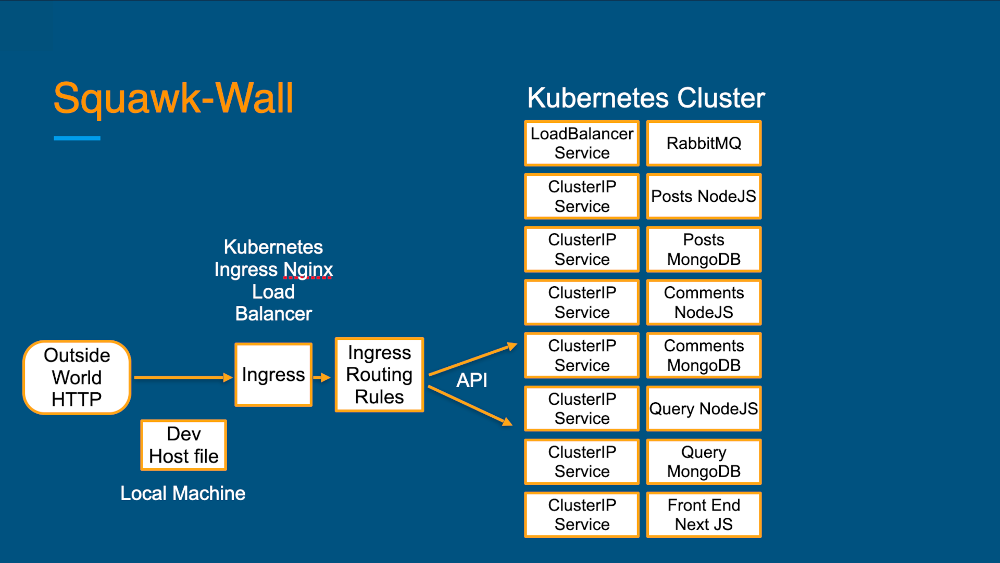
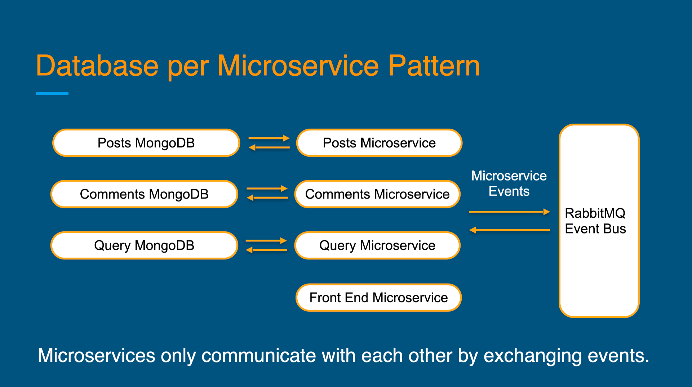
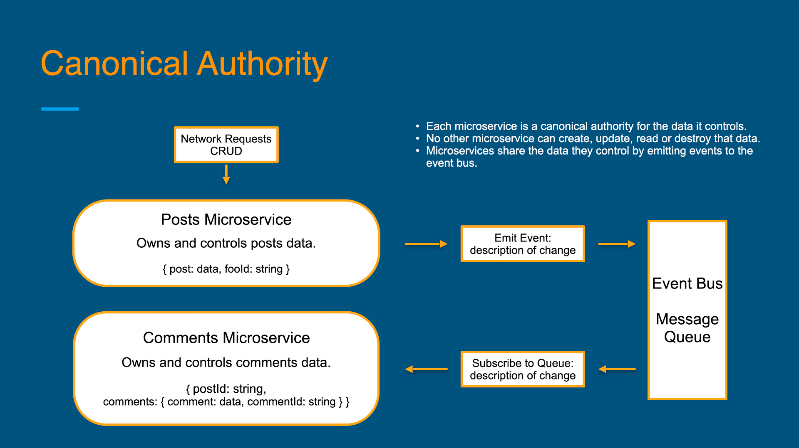

# squawk-wall
A demonstration app for Microservices with NodeJS, MongoDB, Docker, and Kubernetes that can run on your local development system. Uses Next JS with SSR (server side rendering) for the front end.

## Installation

```sh
git clone https://github.com/kurtvandusen/squawk-wall
cd squawk-wall/Comments-Microservice
npm install
cd ../Front-End-Microservice
npm install
cd ../Posts-Microservice
npm install
cd ../Query-Microservice
npm install
```
  
## Set-up Environment

You will need Docker, Kubernetes, Skaffold and Ingress Nginx installed in your development environment.  

[Install Docker Desktop on Windows or MacOS. Install Docker on Linux.](https://docs.docker.com/get-docker/)

[Install Kubernetes on Linux](https://minikube.sigs.k8s.io/docs/start/)

[Install Skaffold](https://skaffold.dev/docs/install/)

[Install Ingress Nginx](https://kubernetes.github.io/ingress-nginx/deploy/)

## Customize local hosts file  

You will also need to customize your local hosts file to point to squawk-wall.dev to your localhost IP address.

Windows:
c:\Windows\System32\Drivers\etc\hosts

macOS and Linux:
/etc/hosts

 Open your hosts file and add the following line at the bottom:
`127.0.0.1 squawk-wall.dev`

## Runnning the Microservices Locally in Development Mode  

Start Docker and Kubernetes on your development system.

Deploy Ingress Nginx
`kubectl apply -f https://raw.githubusercontent.com/kubernetes/ingress-nginx/controller-v1.5.1/deploy/static/provider/cloud/deploy.yaml`


From a terminal in the root dirctory of squawk-wall, run the following command:
`skaffold dev`

Allow time for all of the services to start and connect. Stop any pods which fail to connect. They will restart automatically.

Open your browser and navigate to http://squawk-wall.dev/. You may get a security warning. To bypass this in chrome, type "thisisunsafe" directly in the browser window.

## Building your own Docker images (optional)

Create an account for Docker Hub and login from your CLI. Note: Replace "your-user-name" below with your Docker Hub user name.

From root directory:
```sh
cd Comments-Microservice
docker build -t your-user-name/squawk-wall-comments .
docker push your-user-name/squawk-wall-comments
cd ../Front-End-Microservice
docker build -t your-user-name/squawk-wall-front-end .
docker push your-user-name/squawk-wall-front-end
cd ../Posts-Microservice
docker build -t your-user-name/squawk-wall-posts .
docker push your-user-name/squawk-wall-posts
cd ../Query-Microservice
docker build -t your-user-name/squawk-wall-query .
docker push your-user-name/squawk-wall-query
```

Update the skaffold.yaml and the config/k8s/ -depl.yaml files by replacing "kurtvandusen" with your Docker user name.

## API Documentation  

[openAPI yaml generated with Stoplight](./models/Squawk-Wall-API-Model.yaml)

## Microservice App Architecture  

### Kubernetes Architecture  

  

### Database per Microservice Pattern  

  

### Cannonical Authority  

Note on concurrency issues with async events based communication:  
- Each microservice is a canonical authority for the data it controls.
- No other microservice can create, update, read or destroy that data.
- Microservices share the data they control by emitting events to the event bus.  

